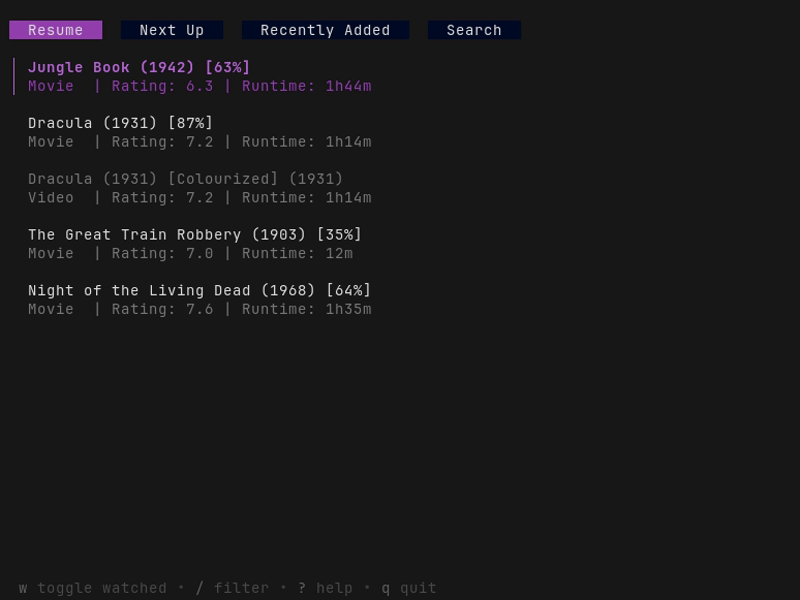

# jfsh

A terminal-based client for [Jellyfin](https://jellyfin.org) that lets you browse your media library and play videos via [mpv](https://mpv.io).
Inspired by [jftui](https://github.com/Aanok/jftui).



## Features

- Uses _your_ mpv config!
- Resumes playback!
- Tracks playback progress and updates jellyfin!
- Automatic segment (intro, etc.) skipping!
- No mouse required!

## Installation

### Prerequisites

- A running [Jellyfin](https://jellyfin.org) instance.
- [mpv](https://mpv.io) available in PATH.

#### Install from AUR

On Arch Linux, jfsh can be installed from the [AUR](https://aur.archlinux.org/packages/jfsh)

```sh
yay -S jfsh
```

#### Install with Nix

Run jfsh directly from GitHub:

```sh
nix run github:hacel/jfsh
```

Or install it into your user profile:

```sh
nix profile install github:hacel/jfsh
```

The Nix package uses an existing `mpv` from `PATH` when available and provides
the packaged `mpv` as a fallback.

#### Download a release

Download the latest pre-built binary for your platform from the [releases page](https://github.com/hacel/jfsh/releases/latest).

#### Install via go

```sh
go install github.com/hacel/jfsh@latest
```

## Usage

1. **Start jfsh**

   ```sh
   jfsh
   ```

2. **Login**

   On first launch, you'll be prompted to enter:

   - **Host**: e.g., `http://localhost:8096`
   - **Username**
   - **Password**

3. **Play Media**

   - Select an item and press **Enter** or **Space** to play it.
   - `mpv` will launch and begin streaming.

4. **Quit**

   - Press **`q`** at any time to exit jfsh.

## Configuration

By default, the configuration file is stored in `$XDG_CONFIG_HOME/jfsh/jfsh.yaml`. If `$XDG_CONFIG_HOME` is not set it defaults to:

- **Linux**: `~/.config/jfsh/jfsh.yaml`
- **macOS**: `~/Library/Application Support/jfsh/jfsh.yaml`
- **Windows**: `%APPDATA%/jfsh/jfsh.yaml`

```yaml
host: http://localhost:8096
username: me
device: mycomputer # Device name to report to jellyfin (default: hostname)
password_file: /run/secrets/jfsh-password # Optional runtime secret file
skip_segments: # Segments to automatically skip (default: [])
  - Recap
  - Preview
  - Intro
  - Outro
```

When no reusable token or `password_file` is available, jfsh prompts for the
password. Passwords are never stored by jfsh. Authentication tokens and the
generated device ID are stored in `$XDG_STATE_HOME/jfsh/state.yaml`.

### Home Manager

The flake exports `homeManagerModules.default`. Import it into a standalone
Home Manager configuration or under `home-manager.users.<name>` in NixOS:

```nix
{
  imports = [ inputs.jfsh.homeManagerModules.default ];

  programs.jfsh = {
    enable = true;

    settings = {
      host = "https://jellyfin.example.com";
      username = "me";
      device = "mycomputer";
      skipSegments = [
        "Recap"
        "Intro"
        "Outro"
      ];
    };

    passwordFile = "/run/secrets/jfsh-password";
  };
}
```

Add jfsh to the consuming flake and share its existing inputs:

```nix
inputs.jfsh = {
  url = "github:hacel/jfsh";
  inputs.nixpkgs.follows = "nixpkgs";
  inputs.home-manager.follows = "home-manager";
};
```

`passwordFile` must be an absolute runtime path. It is a string rather than a
Nix path so the password is not copied into the Nix store. The file can be
provided by a secret manager such as sops-nix or agenix. Omit it to enter the
password interactively on first authentication.

### Migrating existing configuration

The legacy `password`, `token`, `user_id`, `device_id`, and `client_version`
configuration keys are ignored. Remove them manually, especially the plaintext
`password`, and authenticate once to create the new state file. Existing
`host`, `username`, `device`, and `skip_segments` settings continue to work.

### Segment skipping

By default, no segments are automatically skipped. To enable skipping segments you must add `skip_segments` to the configuration file. Possible values for `skip_segments` are the segment types in Jellyfin which are: `Unknown`, `Commercial`, `Preview`, `Recap`, `Outro` and `Intro`.

## Plans

- Configuration through TUI
- Complete library browsing
- Sorting
- Better search: Filter by media type, watched status, and metadata
