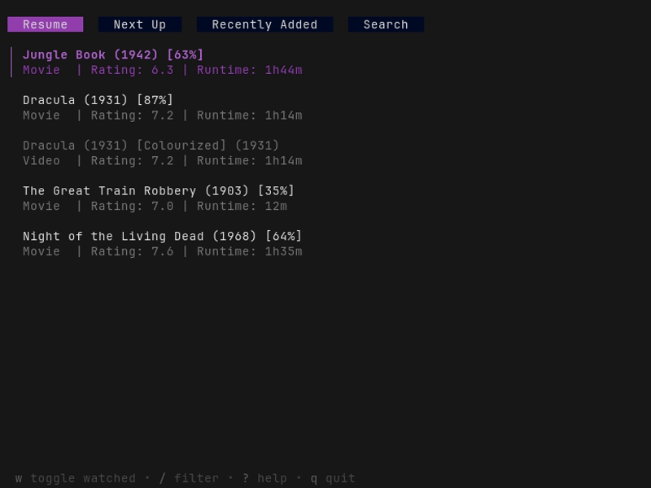

# jfsh

A terminal-based client for [Jellyfin](https://jellyfin.org) that lets you browse your media library and play videos via [mpv](https://mpv.io).
Inspired by [jftui](https://github.com/Aanok/jftui).



## Features

- Search!
- Uses _your_ mpv config!
- Resumes playback!
- Tracks playback progress and updates jellyfin!
- No mouse required!

## Installation

### Prerequisites

- A running [Jellyfin](https://jellyfin.org) instance.
- [mpv](https://mpv.io) available in PATH.

#### Download a release

Download the latest pre-built binary for your platform from the [releases page](https://github.com/hacel/jfsh/releases/latest).

#### Install via go

```sh
go install github.com/hacel/jfsh@latest
```

## Usage

1. **Start jfsh**

   ```sh
   jfsh
   ```

2. **Login**

   On first launch, you'll be prompted to enter:

   - **Host**: e.g., `http://localhost:8096`
   - **Username**
   - **Password**

3. **Play Media**

   - Select an item and press **Enter** or **Space** to play it.
   - `mpv` will launch and begin streaming.

4. **Quit**

   - Press **`q`** at any time to exit jfsh.

## Configuration

Configuration files are stored in `~/.config/jfsh/jfsh.yaml`, there's not really any configuration yet. That's just where the secret variables are stored.

## Plans

- MediaSegments API
- Librariy browsing
- Sorting
- Filtering
- Better search: Filter by media type, watched status, and metadata
- Visual indicator of tab content loading
